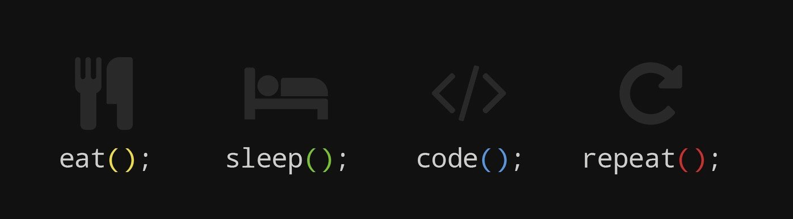

<h1 align="center">Hello I'm Anirban Chakraborty</h1>

<!-- 

  

 -->

## 👨🏻‍💻 About Me:

- 🙋‍♂️ All about me is at **[My Website](https://anirban94chakraborty.github.io/)**
- 👨🏼‍💻 I’m currently working as a <u>_Full Stack Developer_</u>
- 🌱 I’m currently learning `System Design`, `Optimization` and `Scalability`
- 🤝🏼 I’m looking to collaborate for `Dev Projects`
- 🧮 I’m always improving my Problem-Solving Skills using `DSA` 
- 💬 Ask me about `Coding` and `Development` in general
- 🔮 Life Hack: Learn new tech :fire: and share what you have learned :tada:
- 🤠 Fun fact: I always like to stay active by solving problems.

## 🛠️ Technologies and Tools I use:

* Programming Languages

>          

* Frameworks and Libraries

>         

* Databases

>      

* Tools & Services

>                        

## 🔗 Let's get connected:

 
 
  
 

## 🤝 Support Me:

## 📊 My GitHub Data:

  
    
  
    
  <!---->

